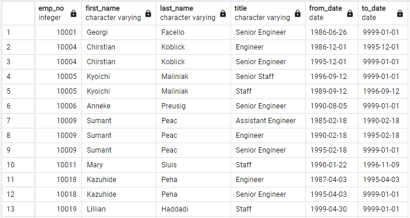
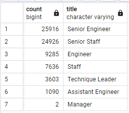
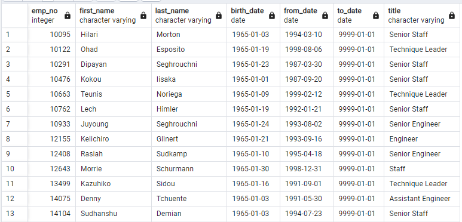

# Pewlett-Hackard-Analysis
databases with SQL

## Overview of the Analysis
### Purpose

The purpose of this analysis was to explore the employees of the fictitious company Pewlett-Hackard (PH), to determine which employees will soon be retiring. The respective manager is trying to prepare for the "silver tsunami" of retirement aged employees that will soon possibly be leaving the company. Also, Pewlett- Hackard is planning to start a mentorship program, where eligible retiring employees may choose to become a part time mentor to incoming employees, instead of complete retirement. The analysis was used to determine how many retiring employees there will be, per job title, as well as identify the employees who are eligible for participating in the mentorship program to be introduced.

## Results

The database that PH has provided consisted of six CSV files containing employee information.
1. Employees
2. Departments
3. Dept_emp
4. Dept_manager
5. Titles
6. Salaries

Through querying, filtering and joining tables in the database the following tables were created.

#### Retirement Titles

Columns from the Employees and Titles tables were joined and then filtered on for retiring age employees that were born between 1952 and 1955. Note that some employees have multiple titles in this dataset.

#### Unique Titles

Using columns from the Retirement Titles table, a query was written to get the first title of each employee, and further filter out the employees that are no longer working for the company. This produced a table of every current unique employee and their job title. 

#### Retiring titles

Using the Unique Titles table, a query was then written to filter the number of current retiring aged employees by their job titles. From this table, it can be deduced that there are 72,458 employees about to retire from PH.

#### Mentorship Eligibility

A query was written to find the mentorship eligible employees that were born between January 1, 1965 and December 31, 1965. There are 1,549 employees that could become mentors.

## Summary
### Points of Interest
-	Pewlett-Hackard has 240,124 current employees.
-	Of the current employees, 72,458 are of retirement age.
-	Approximately one third (33%) of PH employees could potentially retire.
-	1,549 employees could enter the mentorship program.

### PH's Questions Answered

**How many roles will need to be filled as the "silver tsunami" begins to make an impact?**

As the “silver tsunami” begins to impact Pewlett-Hackard, the company may need to hire 72,458 employees, as this is the number of employees eligible for retirement.  

**Are there enough qualified, retirement-ready employees in the departments to mentor the next generation of Pewlett Hackard employees?**

There are only 1,549 possible mentors to teach over 72,000 incoming new employees. From these numbers, each mentor would have about 47 new employees each. This seems implausible for each mentor to handle. It would be recommended that the range for qualified mentors be widened from just the year 1965.

